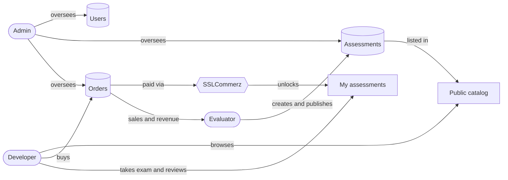
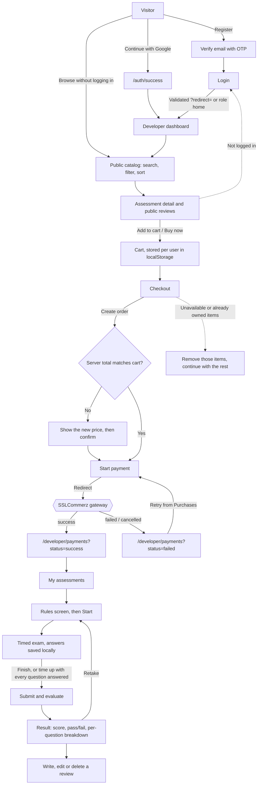
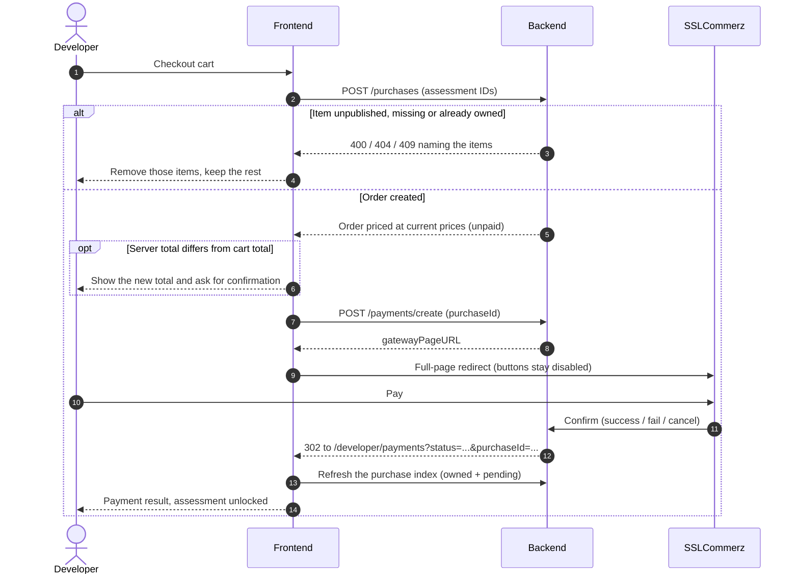
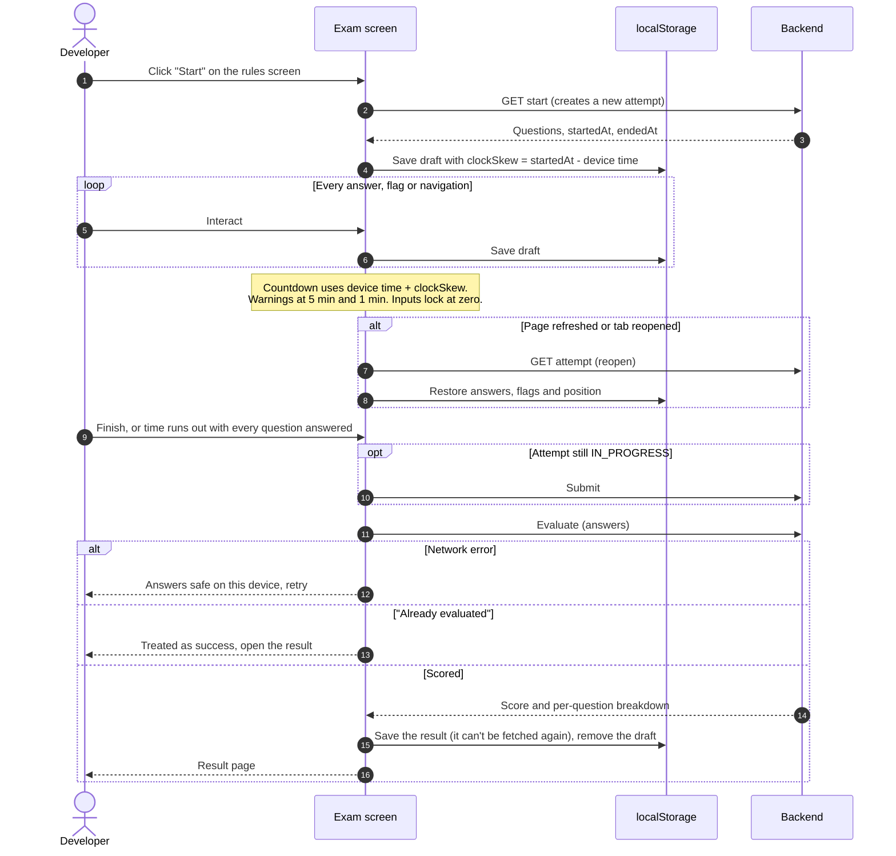
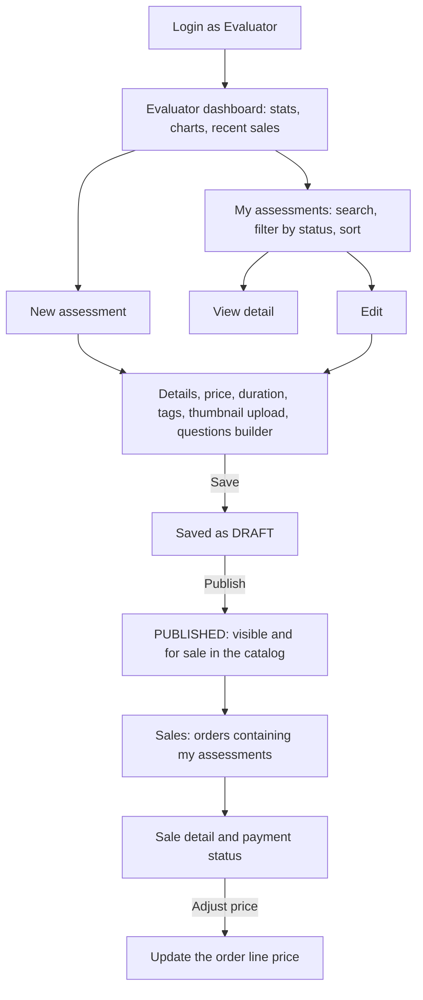
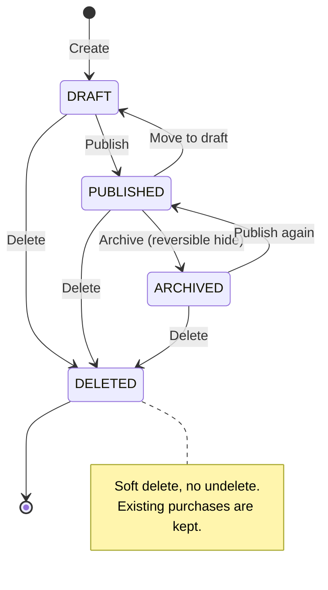
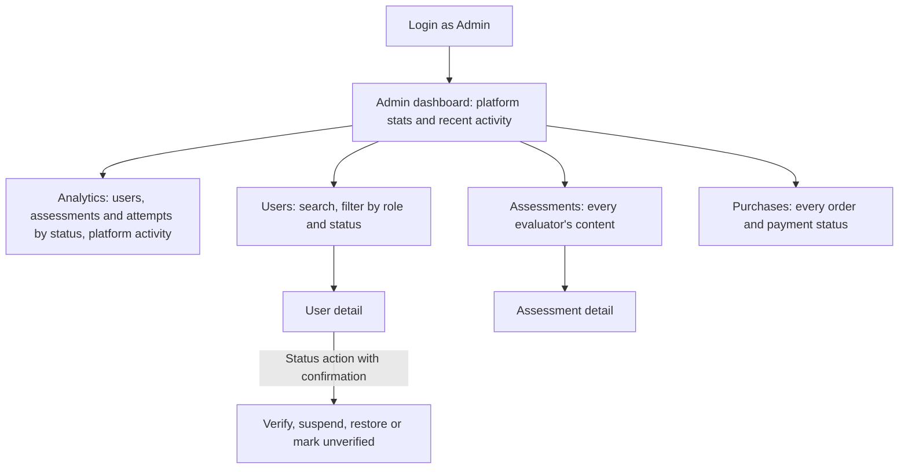
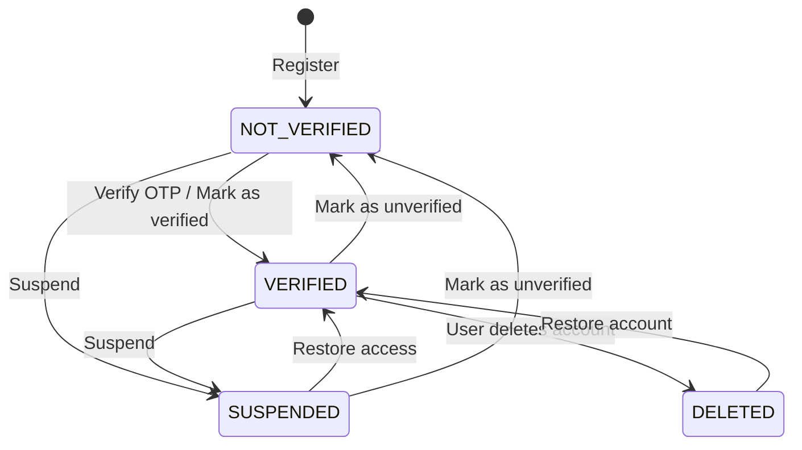
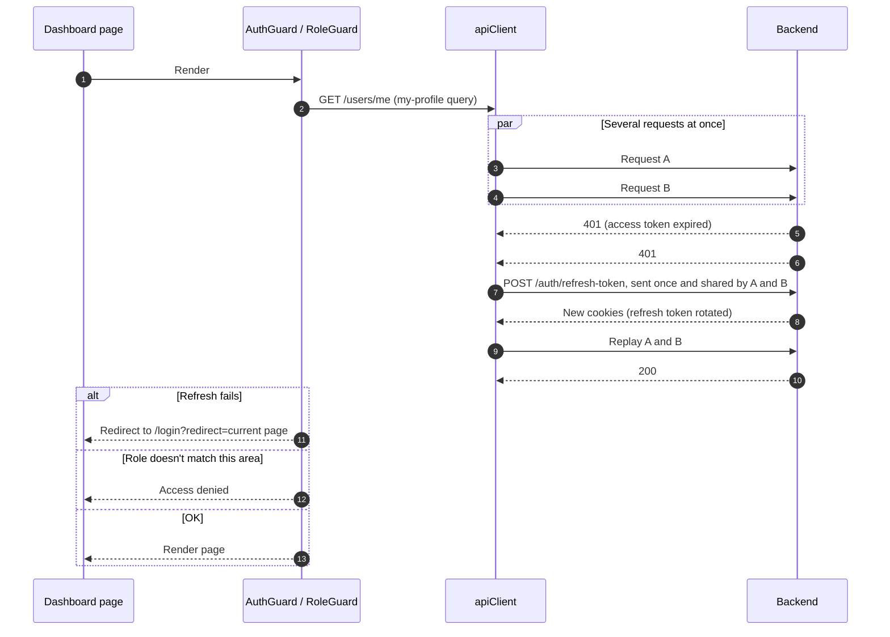

# DevAssess — Developer Assessment Platform (Frontend)

DevAssess is a marketplace for technical assessments. **Evaluators** publish paid assessments, **developers** buy, take and review them, and **admins** oversee users, content and sales across the platform.

This repository contains the web frontend. It is a fully client-rendered **Next.js 16** application, built as a static export, that talks to a separate DevAssess backend over a cookie-authenticated REST API.

---

## Key Highlights

- **Three products in one codebase.** A public marketplace and separate dashboards for developers, evaluators and admins. Each role has its own guarded routes, navigation and data views.
- **A real payment flow.** Cart, checkout and payment through the SSLCommerz hosted gateway. The UI guards against double charges, price changes between cart and checkout, and items that become unavailable before payment.
- **A reliable timed exam.** Answers survive a page refresh, a closed tab or a dropped connection. The timer stays accurate on devices with a wrong clock, and submitting again after a failure is safe.
- **Robust session handling.** Expired sessions refresh silently. Requests that fail at the same time share one refresh call, so the backend's rotating refresh token is never spent twice.
- **Works around backend limitations.** The frontend handles 13 documented backend gaps (G1–G13) itself, including a deadline the server never enforces and duplicate unpaid orders.
- **A static export with no server.** The whole app builds to static HTML/JS and can be hosted on any CDN, with no Node.js server, server actions or middleware.
- **Consistent, maintainable code.** Every domain follows the same api → hooks → view layering, with typed API responses, Zod-validated forms and the React Compiler enabled.

### Skills demonstrated

| Area                    | Evidence in this project                                                                                |
| ----------------------- | ------------------------------------------------------------------------------------------------------- |
| Frontend architecture   | Layered data access, feature-based modules, role-based route groups, static-export routing              |
| State management        | TanStack Query cache design, derived selectors, targeted invalidation, cross-tab synced local state     |
| Reliability engineering | Single-flight token refresh, safe retries, offline-tolerant exam drafts, failure-safe storage access    |
| Security awareness      | Open-redirect protection, per-role redirect checks, user data wiped on logout and account deletion      |
| Payments                | Hosted-gateway redirect, repricing check, stale-cart recovery, double-payment prevention                |
| UI/UX                   | Responsive dashboards, skeleton loaders, light/dark themes with no theme flash, specific error messages |

---

## Table of Contents

- [Key Highlights](#key-highlights)
- [Features](#features)
- [User Workflows](#user-workflows)
- [Engineering Challenges and Solutions](#engineering-challenges-and-solutions)
- [Tech Stack](#tech-stack)
- [Getting Started](#getting-started)
- [Environment Variables](#environment-variables)
- [Available Scripts](#available-scripts)
- [Project Structure](#project-structure)
- [Architecture](#architecture)
- [Routes](#routes)
- [Development Guidelines](#development-guidelines)
- [Deployment](#deployment)
- [Author](#author)

---

## Features

### Public site

- Landing page with hero, feature highlights and calls to action.
- Public assessment catalog with search, filtering, sorting and pagination.
- Public assessment detail pages with overview, key information and reviews.
- About, Contact, Help (FAQ), Privacy and Terms pages.
- Light and dark themes, with dark as the default.

### Authentication

- Email/password registration with OTP account verification.
- Login, forgot password and change password.
- Google OAuth sign-in.
- Quick-login buttons for test accounts (configured through environment variables).
- Role-aware redirects after login. `?redirect=` targets are validated per role.

### Developer

- Dashboard with activity statistics and charts.
- Cart (stored per user), checkout and payment through **SSLCommerz**.
- Purchase and payment history with detail views. Duplicate payments are blocked.
- Owned assessments: a rules screen, a timed exam and a result breakdown.
- Exam drafts saved locally. The exam screen locks at the deadline, corrected for device clock skew.
- Reviews and ratings for completed assessments.

### Evaluator

- Dashboard with sales and content statistics.
- Create, edit and manage assessments and their questions.
- Sales (purchase) list and detail views.

### Admin

- Platform dashboard and analytics.
- User management with detail views.
- Oversight of all assessments and purchases.

### Shared

- Profile management and account deletion for every role.
- Responsive dashboard layout with a role-specific sidebar.

---

## User Workflows

The diagrams below are written in [Mermaid](https://mermaid.js.org/) and render directly on GitHub.

### Platform overview

How the three roles, the frontend, the backend and the payment gateway fit together.



### Developer workflow

The full developer journey, from sign-up to review.



#### Checkout and payment sequence



#### Taking an assessment

The server returns a deadline but doesn't enforce it, so the frontend handles timing, drafts and retries.



### Evaluator workflow



#### Assessment lifecycle



### Admin workflow



#### User status management



### Session and route protection

This applies to every role.



---

## Engineering Challenges and Solutions

The backend was built by a separate team, and its handover docs list 13 gaps (G1–G13), places where the API doesn't enforce or provide what the product needs. Much of the frontend work was about building a reliable product on top of that API. Below are the hardest problems and how each one was solved.

### 1. Concurrent 401s logging users out

**Problem:** The access token is short-lived, and the backend **rotates** the refresh token on every refresh. A dashboard can fire several requests at once. When they all got `401` together, each one tried to refresh, and the second refresh used a token that had already been spent, so the user was logged out at random.

**Solution:** `src/lib/apiClient.ts` wraps `ofetch` with a **single-flight refresh**. The first `401` starts the refresh and stores the promise. Every other failing request waits on that same promise, then replays its original request once. Auth endpoints are excluded because a `401` there is a real answer, such as a wrong password.

**Result:** Sessions refresh silently, with no random logouts and no loops of repeated refresh calls.

### 2. A timed exam the server doesn't enforce

**Problem:** The API returns a deadline (`endedAt`) but never enforces it and never marks an attempt as expired. Answers only reach the server at the final submit. Several things could go wrong: a page refresh could lose every answer, a device with a wrong clock would show the wrong time left, and a long `setTimeout` overflows after about 24.8 days and fires immediately.

**Solution:**

- **Clock-skew correction.** When an attempt starts, the app records the offset between the server's `startedAt` and the device clock. Every countdown uses `now + skew`.
- **Local drafts.** Answers, flagged questions and the current position are saved to `localStorage` on every change, so a refresh, crash or closed tab resumes exactly where the developer left off.
- **The UI enforces the deadline.** At zero, inputs lock. The exam auto-submits only when every question is answered, because the API rejects partial attempts. Warnings appear at 5 minutes and 1 minute, and a `beforeunload` prompt protects an exam in progress.
- **Safe timers.** The deadline timeout is capped at the browser's 2³¹−1 ms limit, and it uses `useEffectEvent` so it always reads the latest answers without restarting the timer.

### 3. Making exam submission safe to retry

**Problem:** Scoring takes two calls: `submit`, then `evaluate`. If the network dropped between them, or a request timed out on the client but succeeded on the server, a retry could fail in a confusing way. The detailed result breakdown is also returned only once and can't be fetched again.

**Solution:** The finish handler is **safe to call repeatedly**. It skips `submit` if the attempt is already submitted. An "already been evaluated" error is treated as success and goes straight to the result page. Network failures keep the draft and tell the user their answers are safe on this device. Every error case gets a specific message. The result breakdown is saved locally as soon as it arrives so it can be viewed again later.

### 4. Preventing double charges

**Problem:** The API lets the same assessment sit in **several unpaid orders**, and it doesn't check ownership again at payment time. A developer could pay an old pending order for an assessment they had already bought through another order, and be charged twice.

**Solution:** One cached query fetches every order (a "purchase index"). Three hooks read different views of it through TanStack Query `select`: **owned assessments**, **the newest pending order for each assessment**, and **all purchases**. This costs a single request. The pay button checks the index and replaces itself with an explanation when paying would charge twice. Buttons stay disabled throughout the redirect to the gateway, and a `409 already paid` response becomes a success message instead of an error.

### 5. Checkout with stale carts and changed prices

**Problem:** The cart lives in the browser, but prices and availability live on the server. By checkout time, an item might be unpublished, already owned or repriced. The server prices the order from current data, so the amount charged could differ from what the user saw.

**Solution:** Checkout is split into **create order**, then **start payment**. If the server's total differs from the cart total, the flow stops and shows the new price before any payment. If the order is rejected, the app reads the error message to work out which cart items caused it, removes only those, and lets the user continue with the rest.

### 6. Building a static site with protected, role-based pages

**Problem:** `output: 'export'` rules out dynamic `[id]` routes, middleware and server-side auth checks. Redirect-after-login is also a common source of open-redirect vulnerabilities, and Google sign-in leaves the site entirely, which loses the page the user wanted.

**Solution:**

- Detail pages take their ID from a query string (`?id=`), wrapped in `<Suspense>` so they work in a static build.
- `AuthGuard` and `RoleGuard` protect routes on the client, with the backend still enforcing permissions.
- `resolveRedirect` only accepts same-origin paths. It rejects `//` and `/\` tricks, auth pages, and **other roles' areas**, so a developer is never sent to an admin "Access denied" page.
- Before a Google sign-in, the target page is saved in `sessionStorage` and restored on `/auth/success`.

### 7. Browser state that is reactive, synced across tabs and safe

**Problem:** The cart, drafts and cached results live in `localStorage`. That storage can throw errors (private mode, full quota), isn't reactive in React, and doesn't sync between tabs. On a shared computer, the next user must not see the previous user's cart or exam answers.

**Solution:** `src/lib/storage.ts` wraps storage in **`useSyncExternalStore`**. It listens to the native `storage` event for other tabs and a custom event for the current tab, and it subscribes to the raw string so renders stay stable. Every read and write handles failures without crashing. All keys share a `devassess:` prefix, so logout and account deletion clear everything in one step.

### 8. Showing backend errors next to the right form fields

**Problem:** The backend returns validation errors as one string, for example `"email: must be valid, password: too short"`, instead of structured field errors.

**Solution:** `parseFieldErrors` splits that message into a map from field name to error, which TanStack Form shows under each field. `getApiErrorMessage` extracts a readable message for toast notifications. The assessment, profile, review and price-adjustment forms use this to show server-side validation errors next to the relevant field.

---

## Tech Stack

| Concern            | Technology                                                                  |
| ------------------ | --------------------------------------------------------------------------- |
| Framework          | [Next.js 16](https://nextjs.org/) (App Router, `output: 'export'`)          |
| UI library         | [React 19](https://react.dev/) with the React Compiler                      |
| Language           | TypeScript 5                                                                |
| Styling            | [Tailwind CSS v4](https://tailwindcss.com/), `tw-animate-css`               |
| Components         | [shadcn/ui](https://ui.shadcn.com/) (`base-nova` style on `@base-ui/react`) |
| Icons              | [lucide-react](https://lucide.dev/)                                         |
| Server state       | [TanStack Query v5](https://tanstack.com/query)                             |
| Forms & validation | [TanStack Form](https://tanstack.com/form) + [Zod v4](https://zod.dev/)     |
| HTTP client        | [ofetch](https://github.com/unjs/ofetch)                                    |
| Charts             | [Recharts](https://recharts.org/) via shadcn `chart`                        |
| Notifications      | [sonner](https://sonner.emilkowal.ski/)                                     |
| Linting            | ESLint 9 (`eslint-config-next`: core-web-vitals + TypeScript)               |

---

## Getting Started

### Prerequisites

- **Node.js** 20.9 or later
- **npm** (a `package-lock.json` is committed)
- A running instance of the **DevAssess backend** API

### Installation

```bash
# 1. Clone the repository
git clone git@github.com:PrinceCuet77/DevAssess-FE.git
cd DevAssess-FE

# 2. Install dependencies
npm install

# 3. Configure environment variables
cp .env.example .env
# then edit .env, at minimum setting NEXT_PUBLIC_API_BASE_URL

# 4. Start the development server
npm run dev
```

The app runs at [http://localhost:3000](http://localhost:3000).

> **Note:** Authentication uses an HTTP-only cookie set by the backend. The backend's CORS settings must allow the frontend origin and credentials. Otherwise login appears to succeed but the session is never sent back.

---

## Environment Variables

All variables are public (`NEXT_PUBLIC_*`) because they are embedded into the static build. **Never put secrets here.**

| Variable                              | Required | Description                                                  |
| ------------------------------------- | :------: | ------------------------------------------------------------ |
| `NEXT_PUBLIC_API_BASE_URL`            |   Yes    | Backend API base URL, e.g. `https://api.example.com/api/v1`  |
| `NEXT_PUBLIC_TEST_DEVELOPER_EMAIL`    |    No    | Email used by the "Developer" quick-login button on `/login` |
| `NEXT_PUBLIC_TEST_DEVELOPER_PASSWORD` |    No    | Password for the developer quick-login account               |
| `NEXT_PUBLIC_TEST_EVALUATOR_EMAIL`    |    No    | Email used by the "Evaluator" quick-login button             |
| `NEXT_PUBLIC_TEST_EVALUATOR_PASSWORD` |    No    | Password for the evaluator quick-login account               |
| `NEXT_PUBLIC_TEST_ADMIN_EMAIL`        |    No    | Email used by the "Admin" quick-login button                 |
| `NEXT_PUBLIC_TEST_ADMIN_PASSWORD`     |    No    | Password for the admin quick-login account                   |

Quick-login credentials are intended for demo and testing environments only. Leave them empty in production.

---

## Available Scripts

| Command            | Description                                  |
| ------------------ | -------------------------------------------- |
| `npm run dev`      | Start the development server with hot reload |
| `npm run build`    | Produce a static export in `out/`            |
| `npm run lint`     | Run ESLint over the project                  |
| `npx tsc --noEmit` | Type-check the project                       |

There is no automated test suite yet. Run `npm run lint` and `npx tsc --noEmit` before every commit.

---

## Project Structure

```
DevAssess-FE/
├── docs/                         # Backend handover docs (API contracts, flows, known gaps)
├── public/                       # Static assets
├── src/
│   ├── api/                      # Thin API functions per domain (auth, user, developer, ...)
│   ├── app/                      # Next.js App Router
│   │   ├── (public)/
│   │   │   ├── (authentication)/ # login, register, verify-account, forgot-password
│   │   │   └── (marketing)/      # home, assessments catalog, about, contact, help, legal
│   │   ├── (dashboard)/          # Authenticated area (AuthGuard)
│   │   │   ├── admin/            # Admin-only pages (RoleGuard)
│   │   │   ├── developer/        # Developer-only pages (RoleGuard)
│   │   │   ├── evaluator/        # Evaluator-only pages (RoleGuard)
│   │   │   ├── profile/          # Shared by all roles
│   │   │   └── change-password/  # Shared by all roles
│   │   ├── auth/success/         # OAuth (Google) return page
│   │   ├── globals.css           # Tailwind v4 theme tokens and chart series colours
│   │   └── layout.tsx            # Root layout, fonts, theme bootstrap script
│   ├── components/
│   │   ├── auth/                 # AuthGuard, RoleGuard, AccessDenied, ...
│   │   ├── form/                 # Auth and password forms (TanStack Form + Zod)
│   │   ├── layout/
│   │   │   ├── dashboard/        # Sidebar, PageContainer, PageHeader, ...
│   │   │   └── public/           # Header, footer, marketing section and legal page primitives
│   │   ├── modules/<feature>/    # Feature views: *-view.tsx with tables, filters, skeletons
│   │   ├── shared/               # Cross-feature components (StatCard, charts, Logo, FaqList)
│   │   └── ui/                   # shadcn primitives, DataTable building blocks
│   ├── constants/                # Routes, sidebar nav, site/contact info, FAQ copy
│   ├── hooks/                    # TanStack Query hooks per domain, plus utility hooks
│   ├── lib/                      # apiClient, error helpers, redirect validation, storage
│   ├── providers/                # Query and theme providers
│   ├── types/                    # Request/response types per domain and feature
│   └── validation/               # Zod schemas
├── components.json               # shadcn CLI configuration
├── next.config.ts                # React Compiler + static export
└── .env.example
```

---

## Architecture

### Static export and client-side rendering

`next.config.ts` sets `output: 'export'`, so the build is plain HTML/JS/CSS that can be served from any static host. This has a few consequences:

- **No dynamic route segments.** Detail pages take their IDs from query strings, e.g. `/admin/assessments/detail?id=...`. Each page reads `useSearchParams().get('id')`, calls `notFound()` when the ID is missing, and is wrapped in `<Suspense>`.
- **No server-side data fetching.** There are no server actions, route handlers or middleware. All data is fetched in the browser through TanStack Query.

### Authentication and authorization

- `src/lib/apiClient.ts` is an `ofetch` instance with `credentials: 'include'`. The backend sets the auth cookie on login.
- On a `401`, the client refreshes the session once and replays the original request.
- The current user is the `['my-profile']` query (`useGetMyProfile`). Profile mutations write their response directly into this cache entry.
- `(dashboard)/layout.tsx` wraps every dashboard page in `AuthGuard`, which sends signed-out users to `/login?redirect=…`. Each role folder adds a `RoleGuard`, which shows `AccessDenied` when the role does not match.
- Roles: `DEVELOPER`, `EVALUATOR`, `ADMIN`. Per-role home paths and sidebar items are defined in `src/constants/routes.ts`.

> Route guards run on the client and only control the UI. The backend enforces the actual permissions.

### Data layer: `api` → `hooks` → `modules`

Each domain follows the same three-layer pattern:

1. **`src/api/<domain>.api.ts`**: thin functions that call `apiClient<ApiResponse<T>>(path, { method, body, query })`. Every response uses a shared envelope:
   ```ts
   { success, statusCode, message, data, meta? } // meta holds pagination
   ```
   List functions strip empty query params before sending them, because the backend rejects values like `search=`.
2. **`src/hooks/<domain>.hook.ts`**: TanStack Query wrappers.
   - `retry: false` everywhere.
   - Detail queries use `select: (r) => r.data`.
   - Paginated lists keep the full envelope (for `meta`) and use `placeholderData: keepPreviousData`.
   - Mutations invalidate every related key (list, detail, dashboard) in `onSuccess`.
3. **`src/types/<domain>-<feature>.types.ts`**: request and response types.

### Components

- `page.tsx` files stay thin and render a `*-view.tsx` from `src/components/modules/<feature>/`.
- Dashboard pages use `PageContainer` (full width by default, `size='form'` for single forms) and `PageHeader`.
- Dashboard charts use `shared/charts/{donut,bar}-chart-card.tsx`, with categorical colours taken in order from the `--series-1..5` CSS variables.

### Developer exam flow

```
/developer/assessments/detail/take      → rules screen; "Start" creates an attempt
/developer/assessments/detail/attempt   → timed exam (?id=&attemptId=)
/developer/assessments/detail/result    → result breakdown
```

- `start` is called from a click on the rules screen and nowhere else, because each call creates a new attempt.
- The server does not enforce the deadline. The exam screen locks at `endedAt` (adjusted for clock skew) and auto-submits only when every question has been answered.
- Exam drafts and results are cached in the browser, because the result breakdown cannot be fetched again later.

### Browser storage

User-specific state (cart, exam drafts, cached results) is stored in `localStorage` under the `devassess:` prefix through `src/lib/storage.ts`. Logout and account deletion clear everything under that prefix. The theme preference is stored separately under `devassess-theme` and is kept.

### Error handling

`src/lib/errors.ts` provides two helpers:

- `getApiErrorMessage(error, fallback)` extracts the backend `message` for toast notifications.
- `parseFieldErrors(error)` turns `400` validation messages (`"field: reason, field: reason"`) into a per-field map for forms.

### Theming

Dark mode is the default. An inline script in the root layout applies the stored theme before hydration so the page does not flash the wrong theme. `ThemeProvider` handles theme changes at runtime.

---

## Routes

| Area          | Routes                                                                                                                                                                                                                                 |
| ------------- | -------------------------------------------------------------------------------------------------------------------------------------------------------------------------------------------------------------------------------------- |
| **Public**    | `/`, `/assessments`, `/assessments/detail`, `/about-us`, `/contact`, `/help`, `/privacy`, `/terms`                                                                                                                                     |
| **Auth**      | `/login`, `/register`, `/verify-account`, `/forgot-password`, `/auth/success`                                                                                                                                                          |
| **Shared**    | `/profile`, `/change-password`                                                                                                                                                                                                         |
| **Developer** | `/developer`, `/developer/my-assessments`, `/developer/assessments/detail{,/take,/attempt,/result}`, `/developer/cart`, `/developer/checkout`, `/developer/purchases{,/detail}`, `/developer/payments{,/detail}`, `/developer/reviews` |
| **Evaluator** | `/evaluator`, `/evaluator/assessments{,/new,/detail,/detail/edit}`, `/evaluator/purchases{,/detail}`                                                                                                                                   |
| **Admin**     | `/admin`, `/admin/analytics`, `/admin/users{,/detail}`, `/admin/assessments{,/detail}`, `/admin/purchases`                                                                                                                             |

---

## Development Guidelines

### Adding a dashboard page

1. Add the API function to `src/api/<domain>.api.ts` and its types to `src/types/`.
2. Add a query or mutation hook to `src/hooks/<domain>.hook.ts` and re-export it from `src/hooks/index.ts`.
3. Build the UI in `src/components/modules/<feature>/<feature>-view.tsx`, using `PageContainer` and `PageHeader`.
4. Create a thin `page.tsx` under the correct role folder in `src/app/(dashboard)/`.
5. For a detail page, read the ID from the query string and wrap the page in `<Suspense>`.
6. To show the page in the sidebar, add it to `ROLE_NAV_ITEMS` in `src/constants/routes.ts`.

### Adding UI primitives

Use the shadcn CLI so the generated code matches the configured `base-nova` style:

```bash
npx shadcn@latest add <component>
```

### Code style

- TypeScript throughout, with the `@/*` path alias for `src/`.
- Single quotes, including JSX attributes, and 2-space indentation.
- Keep comments sparse. Use them to explain _why_, such as backend quirks, not _what_.
- Validate forms with Zod schemas from `src/validation/`.

## Deployment

`npm run build` writes a self-contained static site to `out/`. You can deploy it to any static host, such as Nginx, Netlify, Vercel, Cloudflare Pages, S3 + CloudFront or GitHub Pages.

```bash
npm run build
npx serve out        # preview the production build locally
```

> `npm run start` (`next start`) does not work with `output: 'export'`. Serve the `out/` directory instead.

Deployment checklist:

- Set `NEXT_PUBLIC_API_BASE_URL` **at build time**. Its value is embedded into the bundle.
- Make sure the backend allows the frontend origin with credentials (CORS), and that cookie `SameSite`/`Secure` settings work across the two domains.
- Configure the backend's Google OAuth and SSLCommerz callback URLs to point at the deployed frontend (`/auth/success` and the developer payment pages).
- Configure the host to serve `<route>.html` or `<route>/index.html` for clean URLs, and `404.html` for unknown paths.

---

## Author

<table>
  <tr>
    <td>
      <h3>Rezoan Shakil Prince</h3>
      <p><strong>Senior Software Engineer</strong> at BJIT Ltd</p>
    </td>
  </tr>
</table>

|               |                                                                                      |
| ------------- | ------------------------------------------------------------------------------------ |
| **Portfolio** | [your-portfolio-website.com](https://princecuet77.github.io/)                        |
| **LinkedIn**  | [linkedin.com/in/your-linkedin-id](https://www.linkedin.com/in/rezoan-shakil-prince) |
| **GitHub**    | [github.com/PrinceCuet77](https://github.com/PrinceCuet77)                           |
| **Email**     | [your.email@example.com](mailto:prince.cuet.77@gmail.com)                            |
